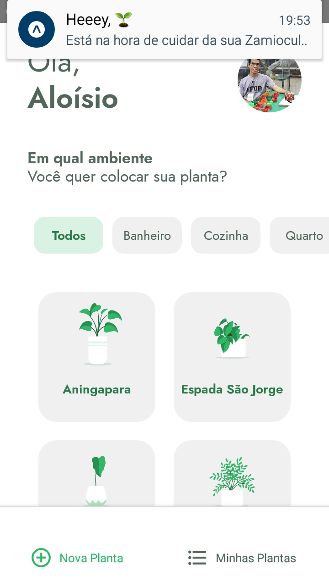

# NLW5 - Trilha React Native - Plant Manager
Aplicação feita durante o evento Next Level Week 05 da [Rocketseat](https://rocketseat.com.br/) de 19/04/2021 - 25/04/2021. Plant Manager é um aplicativo feita em React Native com Expo para ajudar usuários a cuidar melhor de suas plantas.

Ao abrir o aplicativo, o usuário precisa digitar seu nome para prosseguir à tela de seleção de plantas. Nessa tela é possível filtrar as plantas por tipo de ambiente. Após a planta ser escolhida, o usuário deve selecionar um horário em que ela deve ser regada. Esse mesmo horário será alertado por meio de notificações.

O usuário também pode navegar para a tela "Minhas Plantas" e verificar a próxima planta a ser regada ou remover plantas selecionadas anteriormente.

# Aplicação
## Telas Iniciais

  
  
  

## Lista de Plantas

  
  
  

## Minhas Plantas

  
  

## Notificações

  
  

# Funcionalidades
 - Listagem e filtro de plantas
 - Seleção de horários
 - Salvar/Remover plantas em AsyncStorage
 - Loading com animações
 - Notificações

# Utilizar projeto
## Requisitos
    Instalar o Git
    https://git-scm.com/downloads

    Instalar o NodeJs
    https://nodejs.org/en/

    Instalar o Expo
    https://docs.expo.io/get-started/installation/

    Instalar JSON server
    https://www.npmjs.com/package/json-server

## Primeiro passo - baixar o projeto
Faça download do repositório acima ou use o seguinte comando na pasta onde deseja baixar o projeto:
 - git clone https://github.com/AloisioFernandes/NLW5-React-Native.git

## Segundo passo - instalar dependências
Digite o seguinte comando dentro da pasta plantmanager através do terminal:
 - npm install

## Terceiro passo - iniciar projeto
Ainda na pasta plantmanager, digite o seguinte comando no terminal:
 - expo start

Ao executar esse comando, uma página abrirá no seu navegador web. Utilize o aplicativo do expo para abrir o app através do QRCode da página.

## Quarto passo - iniciar JSON server
Ainda na pasta plantmanager, digite o seguinte comando no terminal:
 - json-server ./src/services/ - server.json --host 10.0.0.108 --port 3333
 

 O IP após a flag --host deve ser o mesmo utilizado pelo expo:
 

 Também é necessário utilizar o mesmo IP em api.ts dentro de plantmanager/src/services:
 

 Ao finalizar essas alterações o aplicativo poderá ser utilizado.

# Principais Tecnologias
 - [Expo]((https://docs.expo.io/))
 - [React Native](https://reactnative.dev/)
 - [Axios](https://github.com/axios/axios)
 - [JSON server](https://www.npmjs.com/package/json-server) 